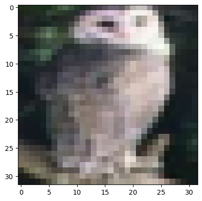
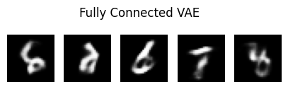
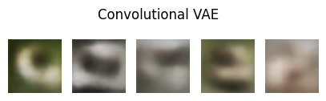
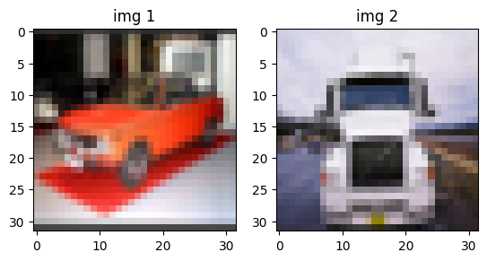
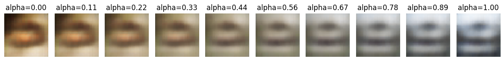
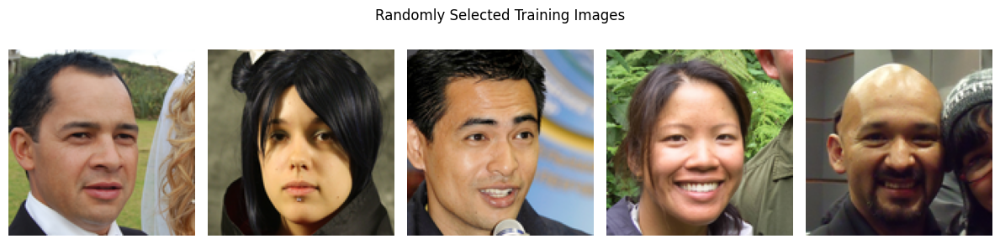
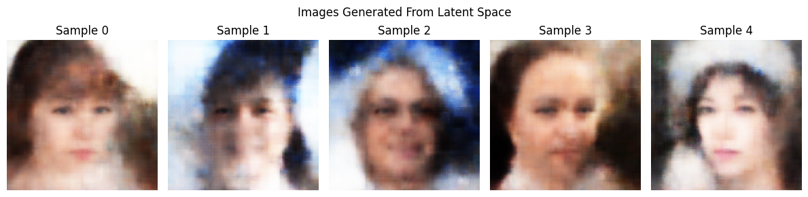

# Assignment 3 writeup

### 1. Theory Questions:
- **Why is the KL Divergence term important in the VAE loss function?**
The KL Divergence term is important in the VAE loss function because it minimizes the difference between the learned distribution of the data and a normal distribution, ensuring a smooth, continuous latent space that allows proper data generation from any point in the latent space.
- **How does the reparameterization trick enable backpropagation through the stochastic layers of a VAE?**
The reparameterization trick enables backpropagation through the stochastic layers of a VAE by transforming the random sampling into a differentiable function by the function $z=\mu+\sigma\epsilon$ where $z \sim N(\mu, \sigma^2)$ and where $\epsilon \sim N(0,1)$. Basically, this reformulation allows the model to learn the parameters of the latent Gaussian distribution $(\mu,\sigma)$ while maintaining differentiability, ensuring gradients can be computed with respect to $\mu$ and $\sigma$ rather than the random sample itself.
- **Why does a VAE use a probabilistic latent space instead of a fixed latent space?**
A VAE uses a probabilistic latent space instead of a fixed latent space because using a probabilistic latent space allows for generation of similar, yet different, data from the same input parameters, as the generation draws from a distribution by sampling different points across the distribution range. A Gaussian distribution is typically used because it is easily reparameterized, as mentioned above, and it is smooth and continuous while being easy to compute and sample from.
- **What role does KL Divergence play in ensuring a smooth latent space?**
The KL Divergence is part of the loss function, which the model aims to minimize. The KL Divergence is part of the regularization which tries to ensure that the model does not wander too far from a known prior distribution. While the data does not have to be normally distributed, using a Gaussian distribution is typical, but not necessary, for the latent space. The decoder can map the normal distribution in the latent space to any other distribution outside of the latent space (the data input) smoothly because of the help of the regularization from the KL Divergence loss function.

### 2. Coding Tasks:
#### **Task 1:**
I started by importing the CIFAR-10 dataset:
```python
transform_train = transforms.Compose(
    [transforms.ToTensor()])

transform_test = transforms.Compose([
    transforms.ToTensor()])

batch_size = 32

trainset = datasets.CIFAR10(root='./data', train=True,
                                        download=True, transform=transform_train)
trainloader = torch.utils.data.DataLoader(trainset, batch_size=batch_size,
                                        shuffle=True, num_workers=2)

testset = datasets.CIFAR10(root='./data', train=False,
                                    download=True, transform=transform_test)
testloader = torch.utils.data.DataLoader(testset, batch_size=batch_size,
                                        shuffle=False, num_workers=2)

classes = ('plane', 'car', 'bird', 'cat',
        'deer', 'dog', 'frog', 'horse', 'ship', 'truck')
```
After importing, I analyzed the dataset a bit, the train dataset has 50,000 images and the test dataset has 10,000 images. The shape of the batches being (32, 3, 32, 32). I chose a batch size of 32 while the images have 3 channels and a width and height of 32 pixels. Plotting a random image yields:

Changing the VAE to use convolutional layers instead of fully connected layers took quite a bit of fine tuning. I set up the encoder as follows:
```python
    self.encoder = nn.Sequential(
        nn.Conv2d(input_dim, hidden_dim, kernel_size=4, stride=2, padding=1), # (batch, 3, 32, 32) -> (400, 16, 16)
        nn.ReLU(),
        nn.Conv2d(hidden_dim, hidden_dim * 2, kernel_size=4, stride=2, padding=1), # (800, 8, 8)
        nn.ReLU(),
        nn.Conv2d(hidden_dim * 2, hidden_dim * 4, kernel_size=4, stride=2, padding=1), # (1600, 4, 4)
        nn.ReLU()
    )
```
I halved the width and the height with each layer, from 32x32 all the way down to 4x4 while expanding the number of the hidden_dim with the same factor, from 400 hidden dimensions up to 1600. $\mu$ and $\sigma$ are fully connected layers with the flattened size and ending with the latent dimension size. In this case, squeezing the highly dimensional 1600 hidden_dim into the 20-dimensional latent_dim. The decoder is the same exact thing but in reverse, expanding the latent_dim back into the hidden_dim and using convolutional layers to get back to the original input dimensions. I had to also edit the encode and decode section as I now included the ReLU layers inside the encoder and the sigmoid at the end of the decoder. I also had to add
```python
# h1.size(0) is the batch, remains unchanged
h1 = h1.view(h1.size(0), -1) # -1 flattens it as (batch_size, 1600, 4, 4) -> (batch_size, 1600 * 4 * 4)
```
to the encoder and
```python
h2 = h2.view(h2.size(0), 1600, 4, 4) # in reverse (batch_size(32) * 1600 * 4 * 4) -> (batch_size, 1600, 4, 4)
```
to the decoder. The loss function had specified dimensions which I had to remove as the CIFAR10 dataset has different dimensionality than the MNIST dataset. The models and data were sent to the GPU to improve model training times. I then compared the MNIST images that the fully connected VAE produced to the CIFAR10 images that the convolutional model produced:

I found that even though the convolutional VAE is more optimized for handling image data, that the FC VAE running on the much simpler MNIST dataset had an easier time of reproducing images that are more distinguishable to my eyes. Of course, most of this is due to the contrast between the pixels in the MNIST dataset, and some of the time is it difficult to identify what numeral is being outputted by the model. The convolutional VAE always produced blurry images, but I expected this as the CIFAR10 dataset is very pixelated, it is just very difficult to produce color images of complex shapes on this small of a resolution, especially given the 32x32 input dimensions of the dataset. I do believe I can identify some of the outputs in the sequence above, however.

#### **Task 2:**
For this task I started off by defining a function that will take the VAE, 2 images, and the number of steps to smoothly transition betwee. I set the VAE to eval mode and calculated $\mu$, $\sigma$, and the reparameterization parameters. This gives us everything we need to decode an image from the encoded data, which we do here:
```python
# decode a combination between the two images
# 0 will be the full first image (1 - 0) * z1 + 0 * z2 = z1
# 1 will be the full second image (1 - 1) * z1 + 1 * z2 = z2
interpolated_images = []
for step in np.linspace(0, 1, num_steps):
    z_interp = (1 - step) * z1 + step * z2
    with torch.no_grad():
        img_interp = vae.decode(z_interp)
    interpolated_images.append(img_interp.cpu().squeeze(0))
```
The linspace provides a gradient between the full outputs of both images. With the interpolated z value calculated, the VAE decodes the image and appends the image (without the batch data, just for plotting purposes) to a list.
I chose 2 random images, plotted them, then calculated their interpolations, and plotted those images:


While blurry, it is easy to distinguish that the left side resembles the shape and color of the original image while the right side resembles the original img 2, with all the other images being interpolated along the gradient. This demonstrates that a VAE can generate vast combinations of data.

#### **Task 3:**
The dataset of faces really piqued my interest so I pursued a similar dataset to the one mentioned in the assignment. I stumbled upon the [Flickr Faces HQ Dataset](https://github.com/NVlabs/ffhq-dataset) by NVlabs. It is a dataset of 70,000 1024x1024 PNG images that contains a large array of different human faces. The full dataset is 89 GB and I would resize it anyway so I opted to download the 128x128 thumbnail version of the dataset which is a more manageable 1.95 GB. Because there are no classes, it is just images in a folder, I opted to create my own dataset class instead of trying to work around the PyTorch DataFolder class. As stated in the [PyTorch docs](https://pytorch.org/tutorials/beginner/basics/data_tutorial.html#creating-a-custom-dataset-for-your-files), a custom dataset needs to implement the init, len, and getitem functions so I did that in a similar way to the tutorial. Because the dataset contains larger images I opted to add one more convolutional layer. Other than that, the model is the same as the convolutional VAE written in Task 1.
For no particular reason, I decided to use PIL Image instead of torchvision read_image, which was used in the PyTorch tutorial. I also defined a train and test split out of habit which is not necessary here, so the actual size of the training dataset is 56,000 images. Due to the long training time I opted to call the 56,000 images sufficient. **Assignment_3_fixes.ipynb** corrects this issue.

The images above are randomly selected and the images generated are random as well, there is no correlation between the rows of images above and below this text. This is just meant to show a sample of what the training dataset looks like versus the quality of images that are produced.

I am very impressed with the quality of most of the images. There are clearly defined features in each individual.